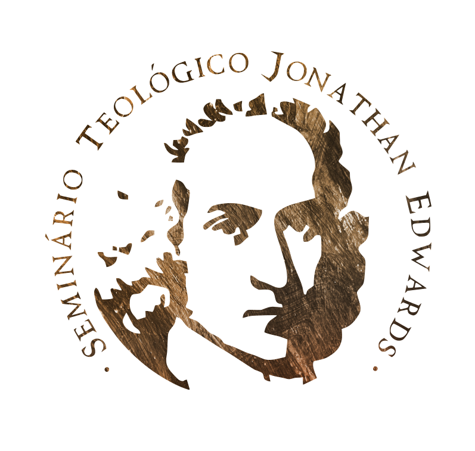

## Curso de Formação em Teologia do Seminário Teológico Jonathan Edwards

O curso de Formação em Teologia (Livre, EAD) do STJE possui um caráter interdenominacional, embora esteja ligado diretamente à uma Igreja pertencente à União das Igrejas Evangélicas Congregacionais do Brasil, a Primeira Igreja Evangélica Congregacional de Caruaru-PE. O curso é destinado a cristãos, de forma geral, que desejem estudar teologia cristã ortodoxa a partir de uma perspectiva reformada.

Abaixo segue a relação das disciplinas que compoem o curso de formação, organizadas em 8 períodos letivos (semestres).

Este conteúdo é mantido e organizado pelo aluno [Cristian Klen](https://br.linkedin.com/in/cristianklen), e contém seu material de estudo.

### 1º SEMESTRE

- [FUNDAMENTOS DA TEOLOGIA](src/semestres/1/fundamentos_da_teologia/README.md)
- [GREGO I](src/semestres/1/greco_i/README.md)
- [HISTÓRIA DO CRISTIANISMO I](src/semestres/1/historia_do_cristianismo_i/README.md)
- [INTRODUÇÃO AO N.T.](src/semestres/1/introducao_ao_nt/README.md)
- [FILOSOFIA I](src/semestres/1/filosofia_i/README.md)
- [TEONTOLOGIA](src/semestres/1/teontologia/README.md)
- [TEOLOGIA DA EVANGELIZAÇÃO](src/semestres/1/teologia_da_evangelizacao/README.md)
- [METODOLOGIA DA PESQUISA](src/semestres/1/metodologia_da_pesquisa/README.md)

### 2º SEMESTRE

- [BIBLIOLOGIA](src/semestres/2/bibliologia/README.md)
- [HISTÓRIA DO CRISTIANISMO II](src/semestres/2/historia_do_cristianismo_ii/README.md)
- [GREGO II](src/semestres/2/greco_ii/README.md)
- [EVANGELHOS SINÓTICOS](src/semestres/2/evangelhos_sinoticos/README.md)
- [FILOSOFIA II](src/semestres/2/filosofia_ii/README.md)
- [ÉTICA CRISTÃ](src/semestres/2/etica_crista/README.md)
- [ANTROPOLOGIA BÍBLICA](src/semestres/2/antropologia_biblica/README.md)
- [MISSIOLOGIA](src/semestres/2/missiologia/README.md)

### 3º SEMESTRE

- [CRISTOLOGIA](src/semestres/3/cristologia/README.md)
- [GREGO III](src/semestres/3/greco_iii/README.md)
- [TEOLOGIA JOANINA](src/semestres/3/teologia_joanina/README.md)
- [FILOSOFIA III](src/semestres/3/filosofia_iii/README.md)
- [HISTÓRIA DO CRISTIANISMO III](src/semestres/3/historia_do_cristianismo_iii/README.md)
- [PENTATEUCO](src/semestres/3/pentateuco/README.md)
- [TEOLOGIA PASTORAL](src/semestres/3/teologia_pastoral/README.md)
- [PLANTAÇÃO DE IGREJAS](src/semestres/3/plantacao_de_igrejas/README.md)

### 4º SEMESTRE

- [HISTÓRIA DE ISRAEL](src/semestres/4/historia_de_israel/README.md)
- [HISTÓRIA DO CRISTIANISMO IV (Contemporâneo)](src/semestres/4/historia_do_cristianismo_iv_contemporaneo/README.md)
- [SOTERIOLOGIA](src/semestres/4/soteriologia/README.md)
- [FILOSOFIA IV](src/semestres/4/filosofia_iv/README.md)
- [PORTUGUÊS INSTRUMENTAL I](src/semestres/4/portugues_instrumental_i/README.md)
- [EXEGESE DE GREGO](src/semestres/4/exegese_de_grego/README.md)
- [ESPIRITUALIDADE CRISTÃ](src/semestres/4/espiritualidade_crista/README.md)
- [TEOLOGIA PAULINA](src/semestres/4/teologia_paulina/README.md)

### 5º SEMESTRE

- [HISTÓRIA DO PENSAMENTO CRISTÃO I (Patrística)](src/semestres/5/historia_do_pensamento_cristao_i_patristica/README.md)
- [PNEUMATOLOGIA](src/semestres/5/pneumatologia/README.md)
- [PORTUGUÊS INSTRUMENTAL II](src/semestres/5/portugues_instrumental_ii/README.md)
- [HISTÓRIA DO CONGREGACIONALISMO](src/semestres/5/historia_do_congregacionalismo/README.md)
- [LITERATURA SAPIENCIAL DO A.T.](src/semestres/5/literatura_sapiencial_do_at/README.md)
- [HERMENÊUTICA BÍBLICA](src/semestres/5/hermeneutica_biblica/README.md)
- [HEBRAICO I](src/semestres/5/hebraico_i/README.md)
- [EPÍSTOLAS GERAIS](src/semestres/5/epistolas_gerais/README.md)

### 6º SEMESTRE

- [APOLOGÉTICA](src/semestres/6/apologetica/README.md)
- [ESCATOLOGIA BÍBLICA](src/semestres/6/escatologia_biblica/README.md)
- [HEBRAICO II](src/semestres/6/hebraico_ii/README.md)
- [LITERATURA APOCALÍPTICA (AT E NT)](src/semestres/6/literatura_apocaliptica_at_e_nt/README.md)
- [HOMILÉTICA I](src/semestres/6/homiletica_i/README.md)
- [LIVROS PROFÉTICOS](src/semestres/6/livros_profeticos/README.md)
- [HISTÓRIA DO PENSAMENTO CRISTÃO II (Escolástica)](src/semestres/6/historia_do_pensamento_cristao_ii_escolastica/README.md)
- [ECLESIOLOGIA GERAL](src/semestres/6/eclesiologia_geral/README.md)

### 7º SEMESTRE

- [TEOLOGIA BÍBLICA DO AT](src/semestres/7/teologia_biblica_do_at/README.md)
- [TEOLOGIA BÍBLICA DO NT](src/semestres/7/teologia_biblica_do_nt/README.md)
- [HEBRAICO III](src/semestres/7/hebraico_iii/README.md)
- [HISTÓRIA DO PENSAMENTO CRISTÃO III (Reforma e modernidade)](src/semestres/7/historia_do_pensamento_cristao_iii_reforma_e_modernidade/README.md)
- [ECLESIOLOGIA CONGREGACIONAL](src/semestres/7/eclesiologia_congregacional/README.md)
- [TEOLOGIA CONTEMPORÂNEA](src/semestres/7/teologia_contemporanea/README.md)
- [DISCIPULADO](src/semestres/7/discipulado/README.md)
- [TEOLOGIA DO CULTO](src/semestres/7/teologia_do_culto/README.md)

### 8º SEMESTRE

- [HISTÓRIA DO PENSAMENTO CRISTÃO IV (Contemporaneidade)](src/semestres/8/historia_do_pensamento_cristao_iv_contemporaneidade/README.md)
- [LÓGICA](src/semestres/8/logica/README.md)
- [LIDERANÇA CRISTÃ](src/semestres/8/lideranca_crista/README.md)
- [EXPOSIÇÃO DE ROMANOS](src/semestres/8/exposicao_de_romanos/README.md)
- [CRISTIANISMO E POLÍTICA](src/semestres/8/cristianismo_e_politica/README.md)
- [MANUSCRITOLOGIA BÍBLICA](src/semestres/8/manuscritologia_biblica/README.md)
- [VOCAÇÃO E CHAMADO](src/semestres/8/vocacao_e_chamado/README.md)
